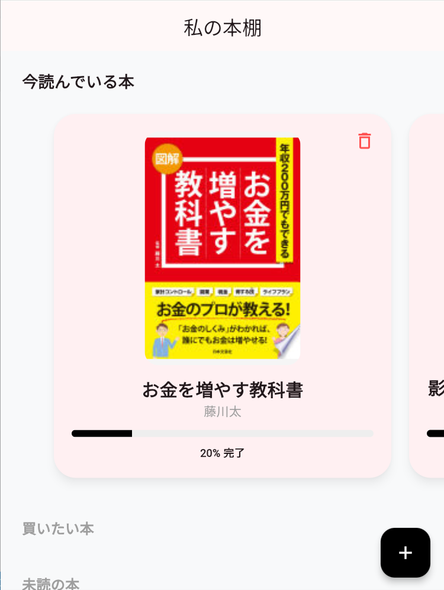

# 📘 Reading Habit  
### 習慣化読書アプリ  
**「読書体験を、ただの消費から一生の資産へ。」**

忙しい社会人・学生が  
**短時間の読書を、確実なアウトプットと習慣に結びつける**ための読書支援Webアプリです。

---

## 🚀 Live Demo
👉 **https://reading-habit-app.web.app**  
（:contentReference[oaicite:0]{index=0} Hosting を利用して公開中）

---

## 🎯 解決したい課題

| 課題 | 内容 |
|---|---|
| ⏰ 時間の不足 | 忙しく、まとまった読書時間が取れない |
| 🧠 定着の欠如 | 読んでも内容を忘れ、行動に活かせない |
| 🔄 継続の難しさ | 一人ではモチベーションが続かない |

➡ **「短時間 × 振り返り × 記録」** によって解決を目指します。

---

## ✨ 主な機能（現在の実装）

### 📚 本の登録・管理
- 読みたい本／読書中の本を **カード形式** で直感的に管理

### ⏱ 読書タイマー（セッション記録）
- 読書時間を計測し、集中力と積み重ねを可視化

### 🧠 クイック・リフレクション
- 読書直後の **気づき・学び** を最小限の手間で記録
- インプットを行動につなげる設計

### 🔥 Firebase 連携
- Google ログイン認証
- Cloud Firestore によるデータ保存
- 複数デバイス間でデータ同期

---

## 🛠 技術スタック

| カテゴリ | 技術 |
|---|---|
| Frontend | HTML5 / CSS3 / JavaScript (Vanilla JS) |
| Backend | :contentReference[oaicite:1]{index=1} (Authentication / Cloud Firestore) |
| Hosting | Firebase Hosting |

---

## 🏗 今後のロードマップ

- 🤖 **AI フィードバック**  
  記録した気づきに対して、AIが問いかけや深掘りコメントを生成
- 📱 **モバイルアプリ化**  
  Flutter による iOS / Android 対応
- 📊 **読書統計の可視化**  
  継続日数・読書量をグラフで表示し達成感を強化

---

## 🧩 開発ステータス

- [x] 基本UI・画面遷移設計  
- [x] Firebase 連携（認証・データ保存）  
- [ ] 習慣化支援ロジックの実装  
- [ ] UI / UX のさらなるブラッシュアップ  

---

## 👤 Author

**Reita Morimune**  
- 広島  工業大学 情報科学部 2年次在学  
- Web / アプリ開発・習慣化プロダクトに関心あり

---

## 📌 このプロジェクトについて
- 設計は自分で行い、実装の一部に AI を活用  
- **「完成度」と「継続価値」を重視した個人開発プロジェクト**
